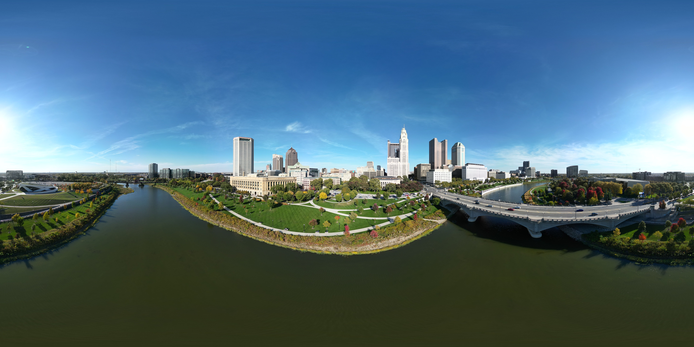

# Challenge #4 - ohio/beauty

Category: Ohio (OSINT)

Challenge description:

> *truly a beautiful panorama. ohio is not always ugly. i really wanna know who made this pano tho. what's their name? flag will look like: UMDCTF{Darryll Pines}*

Included photo: 

## Solution

Reverse image searching the tallest building in the panorama (with the pointed top) leads to LVQ apartments in Columbus, OH. This building is a 1:1 match of our building in the panorama, and shows a bridge across water near it as well.

As the panorama is in the sky, this must be a photosphere on Google Street View. Looking at the photosphere north of the bridge, directly across from LVQ apartments, this view is a 1:1 match with the provided panorama.

The poster of this photosphere is [Neil Larimore.](https://maps.app.goo.gl/VXyQyUTPn83HDUpR6)

>**Flag**: UMDCTF{Neil Larimore}